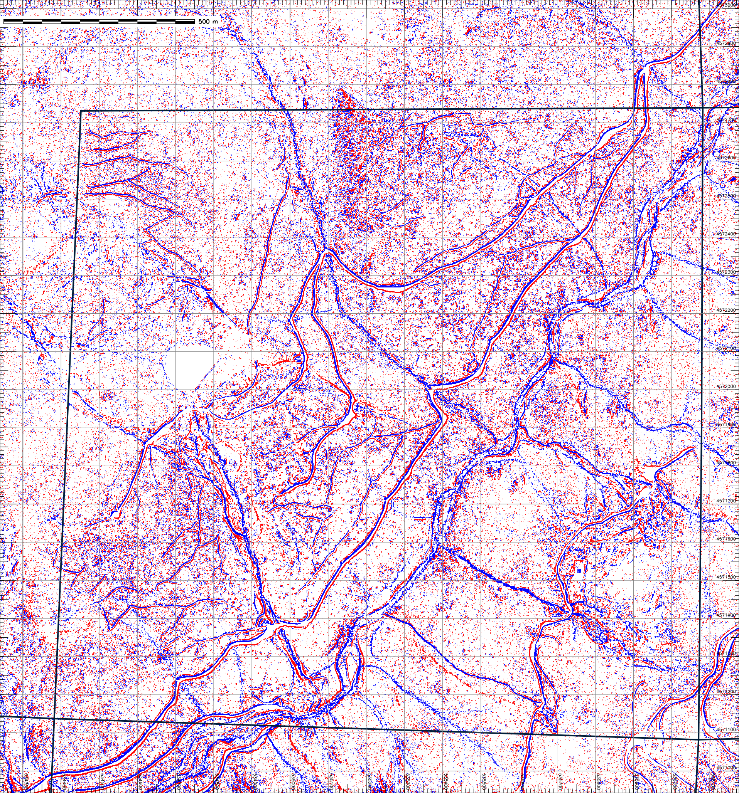

<!-- _class: invert -->
<!-- _color: #ade396 -->

Lidar Forestry Applications in the Upper Trinity Watershed  <!-- fit -->
=====
---

## Topography
<!-- _color: green -->

Yes indeed

---

## Tree Canopy
<!-- _color: green -->

- CHM
- Shown here over slope

---

## Tree Canopy
<!-- _color: green -->

- CHM
- Shown here over slope
---

## Tree Canopy
<!-- _color: green -->

- CHM
- TTOPS

--- 

## Tree Canopy
<!-- _color: green -->

- CHM
- TTOPS
- Crowns

---
## Slope
<!-- _color: green -->

- Slope!

---
## Openness
<!-- _color: green -->

- Integration of relative horizontal elevation in 16 directions within 15 pixel search window on DEM
- i.e., Is there stuff around this pixel?

---
## Red Relief
<!-- _color: green -->

- Nice for visualization
- Based on slope and openness

---
## High Pass Filter
<!-- _color: green -->

- Sharpens local features
- Here with 7.5m focal mean and 0.5 m pixels

---
## High Pass FIlter
<!-- _color: green -->

- Sharpens local features
- Here with 7.5m focal mean and 0.5 m pixels...
- leaving out vertical changes < |0.2 m|

---
## Another Compound visualization
<!-- _color: green -->

- Nice visualization based on openness, slope and high pass filter

---

## Geomorphons
<!-- _color: green -->
<!-- _footer: "" -->

- High frequency spatial data 
- i.e. small features

---
## Geomorphons
<!-- _color: green -->
<!-- _footer: "" -->

- Intermediate frequency spatial data
- i.e., medium sized features

---
## Total Animal Situation (TAS)
<!-- _color: green -->

- Fish
- Unicorn
- shd_05.png

---
## Total Animal Situation (TAS)
<!-- _color: green -->

- Mouse
- slp_05.png
- L. Ron Hubbard

