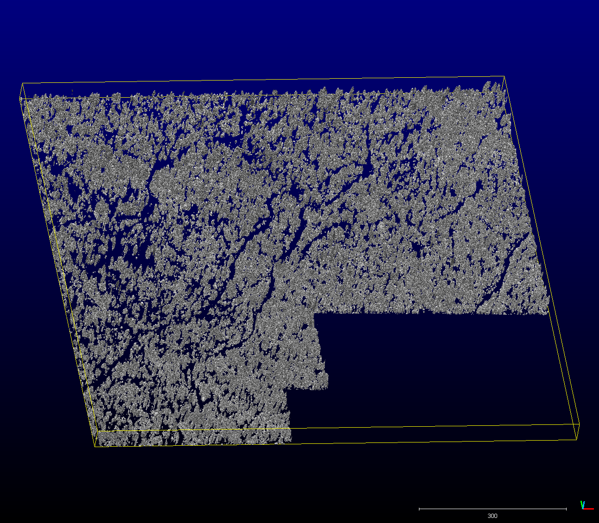

<!-- _class: invert -->
<!-- _color: #ade396 -->

Lidar Forestry Applications in the Upper Trinity Watershed  <!-- fit -->
=====

---
## Site
<!-- _color: green -->

---
## Tree Canopy
<!-- _color: green -->

- CHM
- TTOPS
- Crowns

---
### Tree Canopy - CHM
<!-- _color: green -->

- Shown here over slope

---

### Tree Canopy - CHM
<!-- _color: green -->

- Same image
- Larger scale

---
#### Tree Canopy - Normalized Height
<!-- _color: green -->

---
#### Tree Canopy - ZQ95
<!-- _color: green -->

---
#### Tree Canopy - other ZQ95 
<!-- _color: green -->

---
## Topography
<!-- _color: green -->

- Slope
- Shaded relief
- Openness
- Red Relief
- High Pass Filter
- Geomorphons

---
### Topography - Slope
<!-- _color: green -->

- Slope of DEM

---
### Topography - Shaded relief
<!-- _color: green -->

- A Classic visualization

---
### Topography - Openness
<!-- _color: green -->

- Integration of relative horizontal elevation in 16 directions within 15 pixel search window on DEM
- i.e., Is there stuff around this pixel?

---
### Topography - Red Relief
<!-- _color: green -->

- Nice for visualization
- Based on slope and openness

---
#### Topography - High Pass Filter
<!-- _color: green -->

- Sharpens local features
- Here with 7.5m focal mean and 0.5 m pixels

---
#### Topography - High Pass FIlter
<!-- _color: green -->

- Sharpens local features
- Here with 7.5m focal mean and 0.5 m pixels...
- leaving out vertical changes < |0.2 m|

---
#### Topography - Another Compound visualization
<!-- _color: green -->

- Nice visualization based on openness, slope and high pass filter

---
### Topography - Geomorphons
<!-- _color: green -->
<!-- _footer: "" -->

- Here showing high frequency spatial data 
- i.e. small features

---
### Topography - Geomorphons
<!-- _color: green -->
<!-- _footer: "" -->

- Here showing intermediate frequency spatial data
- i.e., medium sized features

